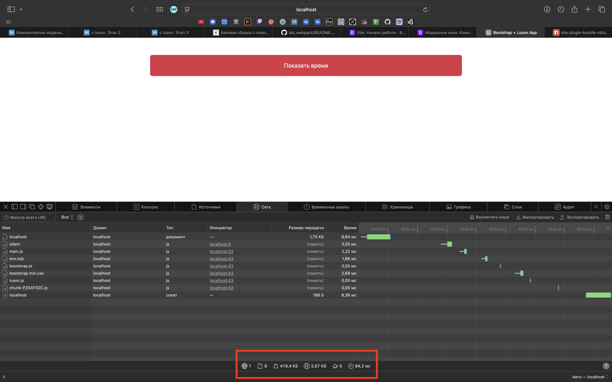
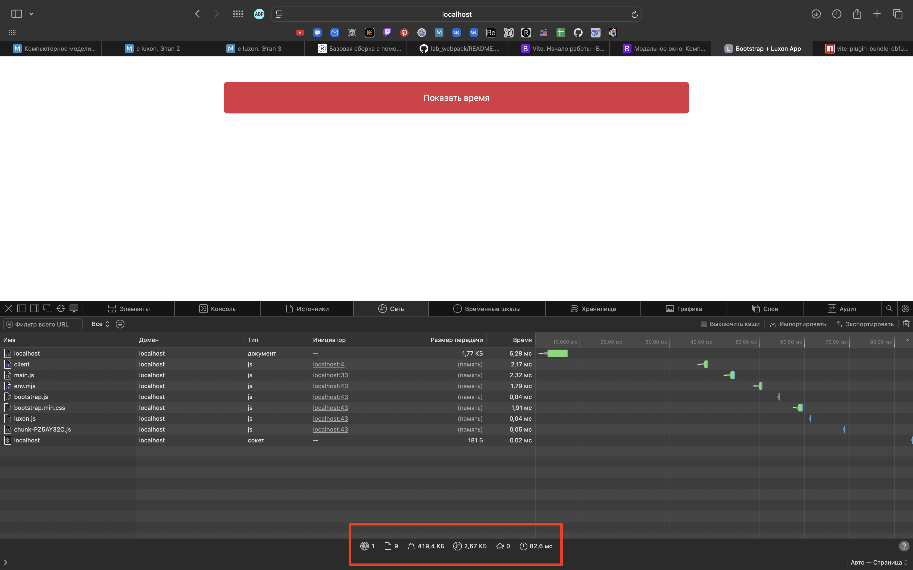

# Отчет по проекту: Bootstrap + Luxon с Vite

## Описание проекта
Проект демонстрирует интеграцию Bootstrap 5 и библиотеки Luxon для работы с датой и временем, собранный с помощью Vite.

## Технологии
- **Vite** - сборщик проекта
- **Bootstrap 5** - UI фреймворк
- **Luxon** - работа с датой и временем
- **JavaScript ES6+**

## Команды для сборки

```bash
# Установка зависимостей
npm install

# Запуск в режиме разработки
npm run dev

# Продакшен сборка
npm run build

# Просмотр продакшен сборки
npm run preview
```

## UI страницы


**Описание:**
- Трехколоночная layout структура (2-8-2)
- Центральная колонка содержит большую красную кнопку "Показать время"
- Кнопка занимает всю доступную ширину колонки

### До и после obfuscator



---

**Выполнил:** Аглиуллин АР  
**Группа:** ИВТ-1(2)  
